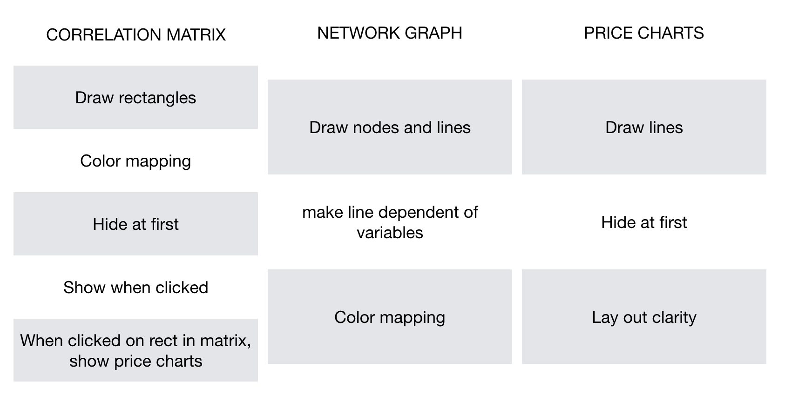

# Design Document
## Getting and transforming the data 

All the data is gathered from one source: the yahoo finance site. Via the finance API of yahoo and Python I could scrape the price histories of the given stocks. This worked by defining the stocks via tickers. After that defining the data source and the time-scale of the data. When that is done the data has to be loaded. This could be done by the Pandas data-reader. After doing this the data could be visualized in a table. 
Given the fact that I split my analysis by doing a new analysis for each industry, because a correlation-matrix for each industry is needed. So for this the table has to be visualized by a (price-history)matrix. After defining this matrix the price-history matrix could be translated in a correlation-matrix. This worked really fast with the NumPy library. 
After doing this a table containing the price history for every stock I analyzed is needed so that the price history charts can be made. I called every stock and visualized in a table. After this exportation of this table in to a CSV file was the last task in preparing the data for importing.  

The last task in transforming the data is importing it in to d3 and making sure that everything works fine for the visualizations. I did some research on how to make all this visualizations. For the correlation matrixes I need to copy the correlation-matrix-output per industry that I gathered from python in to the D3.js file as a variable to work on the data. 
For the CSV file I can load it in de D3.js file via “d3.csv”.   

## Components

#### Correlation-Matrix:
At first I will draw the rectangles and cells. After that I color map the cells dependent of the correlation that the two labels have. If the correlation is positive the color will vary in shades of green. If the correlation is negative the color wil vary in shades of red. I want to hide the correlation-matrix first to keep the user fully focussed on the network graph. Then, when clicking on a button of an industry the correlation matrix of that industry will appear. I will do this to hide the div first. Then when clicking on the button I will show the div. This can be done with javascript in combination with jquery because jquery has functions called hide and show. Then when clicking on a correlation cell the price charts of the two stocks involved in that correlation will appear. I will do this by giving the div’s of the price charts the name of the stock. By doing this I can hide all the div’s at first. When clicking on a correlation matrix I will remember the labels that are clicked, and then via javascript the labels will fill the variables that getting called by the function “Show():”.  

#### Network Graph: 
At first I will draw the nodes and color map these by giving a different color to each industry. Then I will draw the lines. The lines will be dependent on the correlation between the nodes. When there is a strong relation between nodes(stocks in this case) the line will be thicker. I will do this by giving the condition that the closer te correlation gets to -1 or 1 the line-thickness will grow. The color of this lines will have the same color mapping as the correlation matrix: shade of green when positive, shade of red when negative.  

#### Price Charts:
Here I will draw the lines out that are dependent of the price history and time. This is I think the easiest visualization. I want to hide it at first. I will be doing this, as stated earlier, with jquery’s function “hide():”.  How this will work exactly is already stated at the description of the correlation-matrix.  

#### API’s and D3 plugins:
I am going to use d3-tip to provide a lot more functionality to the visualization. When hovering over the nodes in the network graph I want the tooltip to provide information about the stock. When hovering over the line I want the tooltip to provide information about the correlation. Same goes for the correlation matrix, hovering over the cells provides information about correlation. In the price chart I want that hovering over the line will give information about the exact price at that time.   

I already mentioned earlier that I used the yahoo finance API for the gathering of the data. For now I think I will not use any other API. I maybe will reference to my API again when I’m faster done than expected. Then I want to make sure all the data is in realtime. But I first want to make sure that every visualization en interaction works. 