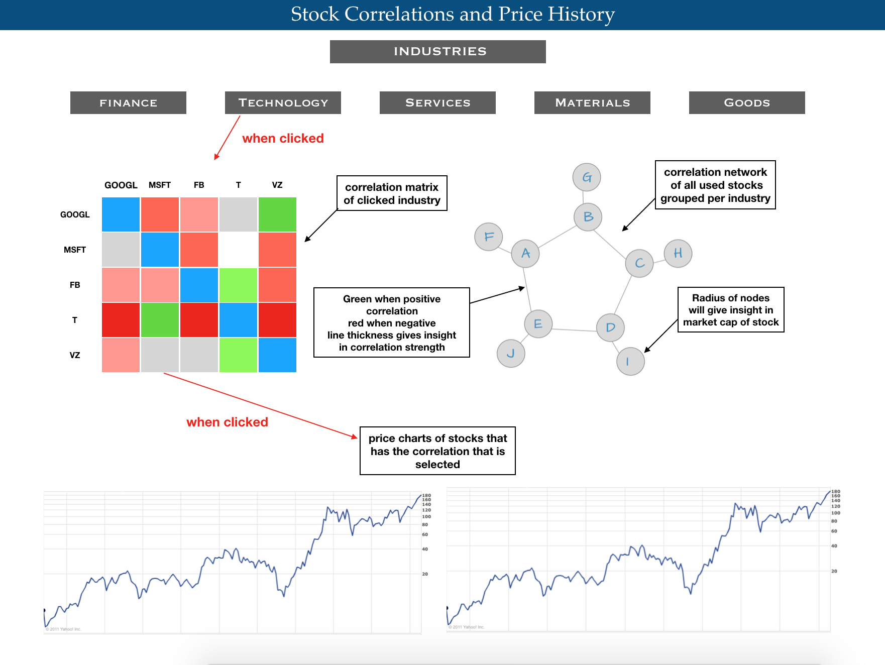

## Problem statement

Investing in stocks is becoming increasingly popular. Due to the complexity, this space is quite inaccesible for people without a financial background. There are no clear connections between the stocks and it seems to behave quite randomly.

## Solution

This inaccesibility is quite a problem for potential newcomers that can be broken down by visualizing the space and connections in this space so that is becomes more clear and easy to get in to. Also by defining the core connections between the stocks via correlation there will be more space left for research in to variables that may, or may not cause these correlations.
To give a bit more clearity in the solution here a simple sketch:

## Main features

The main features presented to the users of the visualization will be a correlation-matrix, a network graph and two price charts over time. I will further explain these features briefly.  

Correlation-matrix  
In the visualization the correlation matrix will be the go to visualization for understanding the connections in the (clicked) industry. This matrix will not show up when site is loaded but when clicked on an industry button above the correlation-matrix with correlations of the top 5 stocks in that clicked industry will appear. When clicked on the button “Industries” a correlation-matrix will show up containing all the industries’ stocks. This will give the users a clear understanding of the correlations in the industries itself, but also of the correlations of the industries reciprocally.  

The Network Graph  
The network graph will be another visualization for better understanding the connections of the industries. This graph will be the main visualization that will always show up. This is because I think this is the final and most clear visualization that summarizes the rest in a clear and understandable way. In the network I want to group the stocks per industry. This will be the 5 top stocks of the industry. The radius of the nodes will give an insight in the market capitalization of the stock. The lines of the graph will be either some kind of red (negative correlation) or some kind of green (positive correlation). When hovering over the nodes a tooltip will show up that contains the stock and market capitalization. When hovering over the lines a tooltip will show up with the stocks and the correlation that these stocks have.  

The Price Charts  
The price charts will be the visualizations that give clarity in the price history of the stock. These charts will show up when clicked on a correlation in the correlation-matrix. The charts will show up of the two stocks that are affiliated with the clicked correlation. With a line graph per stock I want to visualize the gradients where the correlations are based on. This is necessary for the understanding of the correlations.  

## Prequisities

Data Sources  
http://www.learndatasci.com/python-finance-part-yahoo-finance-api-pandas-matplotlib/  
https://finance.yahoo.com/  
For obtaining the stock data I used the yahoo finance API. Yahoo finance is up to date to the latest stock prices and has all the history. This API uses Python. With this API one can call the stocks to analyze. With the python libraries pandas, numpy and mathplotlib one can analyze these stocks, put them in a matrix and calculate the correlations to obtain the correlation matrix. One can also just obtain the price history via this API.  

External components  
http://labratrevenge.com/d3-tip/  
For giving more power to the visualization I will probably use d3-tip. This will clarify a lot and is easy to use. 

Similar of related visualizations  
I literally couldn’t find anything manageable related to stocks and its correlation. All the things that are related to this are really abstract researches that can’t bring any clarity to the target audience I want to achieve. This is also what I said earlier: investing in stocks is a really abstract space that can’t bring any understanding to people without a financial background. This is also why this really needs to be done.  

Hardest parts  
The hardest parts will be the connections between all the visualizations. I already had some troubles doing this in the earlier stage of this minor. So this will be a challenge, but I think (with maybe some help sometimes) it will be manageable.  