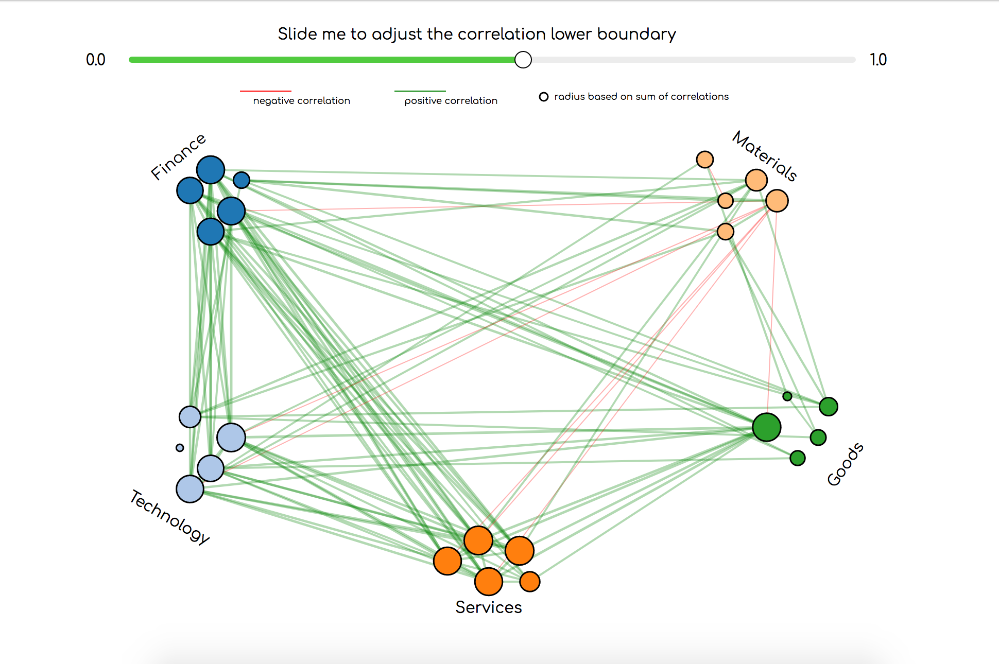
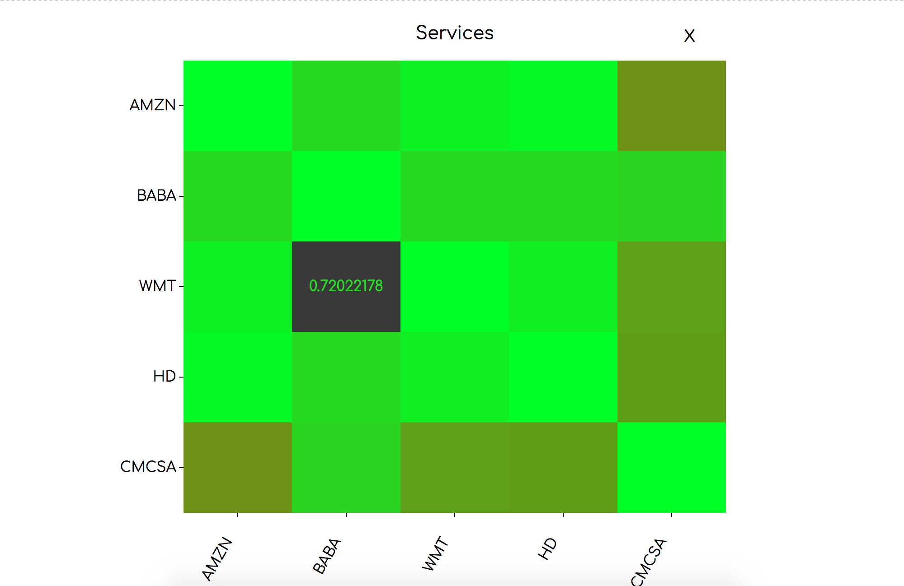
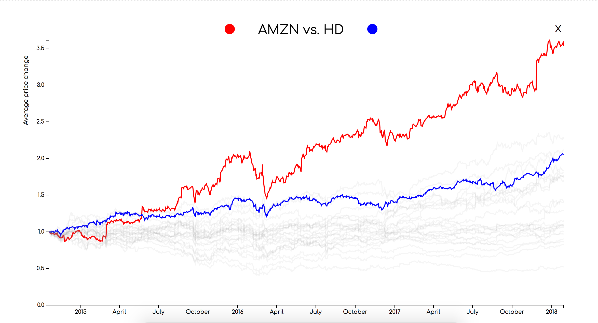

# D3 Finance
Nordin Bouchrit  	
11050608
 
Project Link: https://nordin11.github.io/DataProject/code/index.html
 
## The product

Investing in stocks is becoming increasingly popular. Due to the complexity, this space is quite inaccesible for people without a financial background. There are no clear connections between the stocks and it seems to behave quite randomly. With this product I want to build a bridge over the knowledge gap by giving a go to insight in the financial system and trigger users to do further research in what they consume from this product.   

### The network
The network serves as a overall view over the system. In this visualization one can see the correlation lines of the stocks in general, not in detail. With the radius of the nodes one can see which of the company's has the biggest sum of correlations, by this one can conclude which company has the most influence in the system. This has to serve as a helicopter view over the system.

### The correlation matrix
The correlation matrix gives a little bit more detailed information. By clicking on an option in the dropdown menu the user zooms in at a the chosen industry by seeing the correlation matrix of the industry itself. This serves as an indicator in how the industries work between themselves.
 

### The line graph 
The line graph gives the user an insight in the average price change of the two stocks that have a correlation. By clicking on a cell in the correlation matrix the user gets a line graph of the two stocks that affiliate with that cell. By this the user gets another zoom in and more detailed information. By this the user gets another zoom in with more detailed information and more clarity in where this correlation comes from.
 

### Remember!!
This product doesn't serve as investment advise. It just tries to serve as a tool for gaining more insight in the financial system. You have to make your own conclusions and decisions.   

## Prequisities

#### Data Sources 
#### Tutorial 
http://www.learndatasci.com/python-finance-part-yahoo-finance-api-pandas-matplotlib/  
#### Data gathering
https://finance.yahoo.com/  

#### External Sources
##### Slider
https://bl.ocks.org/Lulkafe/3832d628340038d9484fbd9edb705e01 
##### Network 
https://bl.ocks.org/mbostock/4062045 
##### Correlation matrix
https://bl.ocks.org/arpitnarechania/caeba2e6579900ea12cb2a4eb157ce74 
##### Line graph
https://bl.ocks.org/d3noob/4db972df5d7efc7d611255d1cc6f3c4f 

